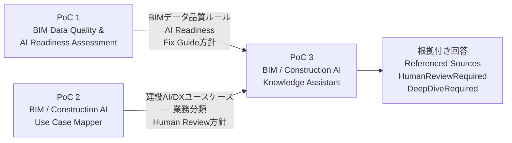
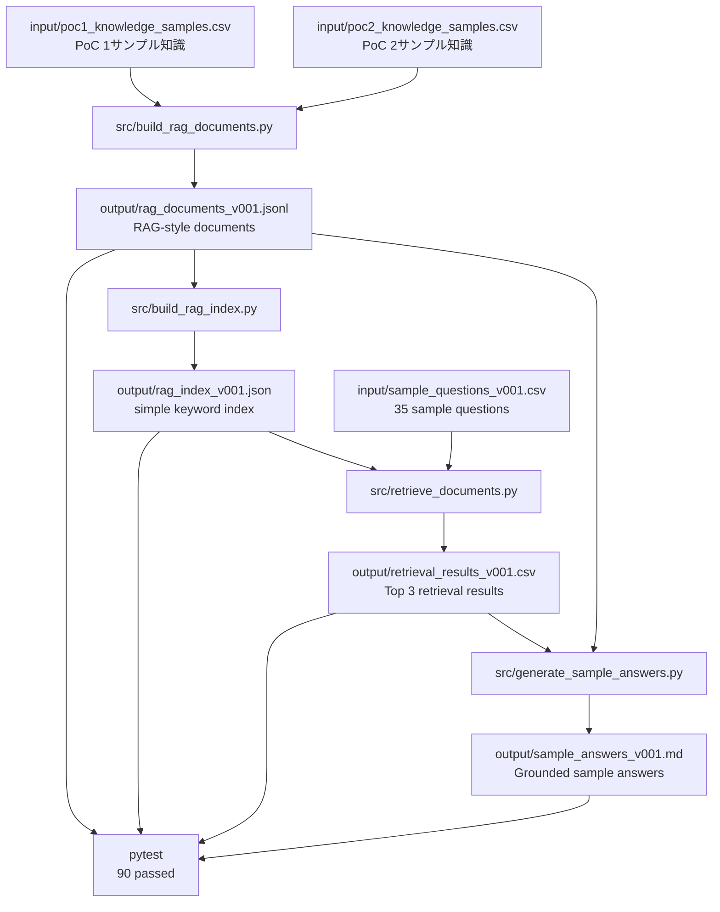
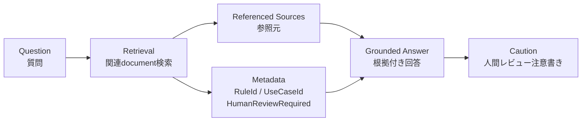

# BIM / Construction AI Knowledge Assistant PoC

## 概要

このリポジトリは、BIMデータ品質評価の知識と、建設業務におけるAI/DX活用ユースケースの知識を検索し、**根拠付きで回答するナレッジ検索アシスタント**のPoCです。

PoC 1・PoC 2で作成した成果物を、単なる個別ファイルとして終わらせるのではなく、検索・参照・説明できる形に整理することを目的としています。

```text
PoC 1：
BIMデータがAI活用に適しているかを評価する

PoC 2：
BIM・建設業務がどのAI/DX活用に適しているかを分類する

PoC 3：
PoC 1・PoC 2の成果物を検索し、根拠付きで説明する
```

全体の流れは以下です。

```text
データ品質評価
↓
業務ユースケース分類
↓
ナレッジ検索・根拠付き回答
```

### PoC全体の関係図



このPoCでは、クラウドAI、OpenAI API、Azure AI Search、ベクトルDB、Embeddingなどは使用していません。
まずはローカル環境で、**RAG-style document設計、簡易検索、根拠付き回答生成、pytestによる検証**までを小さく実装しています。

---

## 目的

このPoCの目的は、BIM・建設AIに関するナレッジを、検索可能な形に整理し、質問に対して根拠付きで回答する基本構造を作ることです。

想定する質問例は以下です。

* Door Name Missing Rule は何を意味するか
* Room Name Missing Rule は何を意味するか
* AI Readiness Score は何を判断するためのものか
* HumanReviewRequired=True の場合、何に注意すべきか
* HumanReviewRequired=False なら人間確認は不要なのか
* 建設業務に対して、どのAI/DX活用候補が考えられるか
* GitHub公開時に注意すべき制約は何か
* 回答の根拠となる参照元はどれか

重要なのは、自由な文章生成そのものではありません。
このPoCで重視しているのは、**検索結果に基づき、参照元を示しながら回答する構造**です。

---

## ポートフォリオ上の位置づけ

このリポジトリは、BIM / Construction AI ポートフォリオにおける **PoC 3** です。

| PoC   | テーマ                                        | 役割                           |
| ----- | ------------------------------------------ | ---------------------------- |
| PoC 1 | BIM Data Quality & AI Readiness Assessment | BIMデータ品質とAI活用準備度を評価する        |
| PoC 2 | BIM / Construction AI Use Case Mapper      | BIM・建設業務をAI/DX活用候補に分類する      |
| PoC 3 | BIM / Construction AI Knowledge Assistant  | PoC 1・PoC 2の知識を検索し、根拠付きで説明する |

PoC 3は、PoC 1・PoC 2を置き換えるものではありません。
PoC 1・PoC 2で作成したルール、分類、方針、制約、ユースケースを、検索可能なナレッジとして再利用するためのPoCです。

---

## このPoCで実装したこと

このPoCでは、以下の処理を実装しています。

1. PoC 1・PoC 2のサンプル知識をCSVで用意
2. CSVをRAG-style document形式のJSONLに変換
3. JSONLから簡易キーワードインデックスを生成
4. サンプル質問に対して関連documentを検索
5. 検索結果をもとに、根拠付き回答Markdownを生成
6. 生成物をpytestで検証

### 処理フロー図



### 回答生成の考え方



---

## このPoCで実装していないこと

このMVPでは、以下は意図的に対象外にしています。

* Azure AI Searchの実装
* Azure OpenAI / OpenAI APIの利用
* LangChain / LlamaIndexの利用
* Embedding生成
* ベクトルDB
* FAISS / Chroma
* 本番RAG構成
* 実案件データの利用
* 顧客データの利用
* 社内機密データの利用
* Revitモデルの自動修正
* BIMデータの自動変更
* 設計判断、施工判断、法規判断、安全判断、契約判断の自動化

このPoCは、あくまでローカル環境で動くMVPです。
本番利用を想定したシステムではありません。

---

## フォルダ構成

```text
bim-construction-ai-knowledge-assistant/
│  .gitignore
│  README.md
│
├─docs
│      answer_policy.md
│      bim_to_ai_workflow_blueprint.md
│      chunk_design.md
│      human_review_policy.md
│      limitations.md
│      metadata_design.md
│      mvp_scope.md
│
├─input
│      poc1_knowledge_samples.csv
│      poc2_knowledge_samples.csv
│      sample_questions_v001.csv
│
├─output
│      rag_documents_v001.jsonl
│      rag_index_v001.json
│      retrieval_results_v001.csv
│      sample_answers_v001.md
│
├─src
│      build_rag_documents.py
│      build_rag_index.py
│      generate_sample_answers.py
│      retrieve_documents.py
│
└─tests
       test_rag_documents.py
       test_rag_index.py
       test_retrieval_results.py
       test_sample_answers.py
```

---

## 主な入力ファイル

### `input/poc1_knowledge_samples.csv`

PoC 1由来のサンプルナレッジです。

BIMデータ品質ルール、AI Readiness、RAG設計方針、人間レビュー方針などを含みます。

例：

* Door Name Missing Rule
* Room Name Missing Rule
* AI Readiness Score
* RAG Design Policy
* Human Review Policy

---

### `input/poc2_knowledge_samples.csv`

PoC 2由来のサンプルナレッジです。

建設業務とAI/DX活用候補の対応関係、ユースケース分類、人間レビュー方針などを含みます。

例：

* Meeting Minutes AI
* Invoice Processing AI
* BIM Data Check
* Construction AI Use Case
* Human Review Policy

---

### `input/sample_questions_v001.csv`

検索・回答生成を確認するためのサンプル質問です。

現在は35問を用意しています。

例：

* Door Name Missing Rule は何を意味しますか
* Room Name Missing Rule は何を意味しますか
* AI Readiness Score は何を判断するためのものですか
* HumanReviewRequired=Falseなら人間確認は不要ですか
* GitHub公開時に注意すべき制約は何ですか

---

## output/ をGit管理している理由

通常の開発リポジトリでは、生成物を `output/` 配下に出力し、Git管理から除外する場合があります。

ただし、このリポジトリではPoCの処理結果を確認しやすくするため、`output/` 配下の生成済みサンプル成果物もGit管理しています。

`output/` には、以下の成果物を含めています。

* `rag_documents_v001.jsonl`：PoC 1・PoC 2のサンプルナレッジをRAG-style document化したもの
* `rag_index_v001.json`：簡易キーワードインデックス
* `retrieval_results_v001.csv`：サンプル質問に対する検索結果
* `sample_answers_v001.md`：参照元付きの根拠付き回答サンプル

これにより、GitHub上でコードだけでなく、入力データ、処理結果、回答サンプル、pytest検証結果まで一連の流れを確認できるようにしています。

なお、`output/` に含まれるデータはすべてデモ用のサンプルデータであり、実案件データ、顧客データ、社内機密情報は含めていません。

---

## 主な出力ファイル

### `output/rag_documents_v001.jsonl`

PoC 1・PoC 2のサンプルナレッジを、RAG-style documentとして変換したJSONLファイルです。

1行につき1documentです。

主な項目は以下です。

* `document_id`
* `source_poc`
* `source_type`
* `title`
* `content`
* `metadata`
* `keywords`

例：

```json
{
  "document_id": "P1-RULE-D001",
  "source_poc": "PoC1",
  "source_type": "RuleMaster",
  "title": "Door Name Missing Rule",
  "content": "...",
  "metadata": {
    "category": "Door",
    "rule_id": "D-001",
    "use_case_id": "",
    "severity": "Medium",
    "recommended_approach": "Human Review",
    "human_review_required": true,
    "deep_dive_required": false,
    "source_file": "poc1_knowledge_samples.csv"
  },
  "keywords": [
    "Door",
    "Name",
    "Missing",
    "Rule"
  ]
}
```

---

### `output/rag_index_v001.json`

`rag_documents_v001.jsonl` から生成した簡易キーワードインデックスです。

これはベクトルインデックスではありません。
Embeddingも使用していません。
ローカルMVP用の `simple_keyword_index` です。

主な項目は以下です。

* `index_version`
* `index_type`
* `description`
* `document_count`
* `token_count`
* `documents`
* `inverted_index`

---

### `output/retrieval_results_v001.csv`

`sample_questions_v001.csv` の各質問に対する検索結果です。

各質問に対して、最大Top 3の関連documentを取得します。

主な項目は以下です。

* `QuestionId`
* `Question`
* `Rank`
* `DocumentId`
* `SourcePoC`
* `SourceType`
* `Title`
* `MatchedKeywords`
* `Score`
* `RuleId`
* `UseCaseId`
* `RecommendedApproach`
* `HumanReviewRequired`
* `DeepDiveRequired`
* `SourceFile`

---

### `output/sample_answers_v001.md`

検索結果をもとに生成した、根拠付き回答のサンプルです。

各回答には以下を含めています。

* Question
* Answer
* Reasoning Summary
* Referenced Sources
* Metadata Summary
* HumanReviewRequired
* DeepDiveRequired
* Caution

この回答生成はテンプレートベースです。
LLMによる自由生成ではありません。

---

## 実行手順

### 1. RAG-style documentを生成

```powershell
python src/build_rag_documents.py
```

想定結果：

```text
RAG-style documents generated successfully.
Total documents: 38
PoC1 documents: 16
PoC2 documents: 22
```

生成ファイル：

```text
output/rag_documents_v001.jsonl
```

---

### 2. 簡易キーワードインデックスを生成

```powershell
python src/build_rag_index.py
```

想定結果：

```text
RAG-style keyword index generated successfully.
Total documents: 38
PoC1 documents: 16
PoC2 documents: 22
Unique tokens: 565
```

生成ファイル：

```text
output/rag_index_v001.json
```

---

### 3. サンプル質問に対して検索を実行

```powershell
python src/retrieve_documents.py
```

想定結果：

```text
Document retrieval completed successfully.
Questions: 35
Retrieval result rows: 105
No-result rows: 0
Top K: 3
```

生成ファイル：

```text
output/retrieval_results_v001.csv
```

---

### 4. 根拠付き回答Markdownを生成

```powershell
python src/generate_sample_answers.py
```

想定結果：

```text
Sample grounded answers generated successfully.
Questions: 35
No-result questions: 0
```

生成ファイル：

```text
output/sample_answers_v001.md
```

---

## テスト

全テストを実行します。

```powershell
pytest
```

現在の結果：

```text
collected 90 items

tests/test_rag_documents.py ...................
tests/test_rag_index.py ........................
tests/test_retrieval_results.py ......................
tests/test_sample_answers.py .........................

90 passed in 0.20s
```

---

## テスト内容

### `tests/test_rag_documents.py`

`output/rag_documents_v001.jsonl` を検証します。

確認内容：

* ファイルが存在する
* documentが空ではない
* 必須フィールドが存在する
* metadataが存在する
* `document_id` が重複していない
* PoC 1 / PoC 2 のdocumentが含まれている
* RuleMaster / UseCaseMapping が含まれている
* HumanReviewRequired / DeepDiveRequired が含まれている
* Door / Room の代表ルールが含まれている
* UseCaseIdが含まれている
* 禁止表現が含まれていない

---

### `tests/test_rag_index.py`

`output/rag_index_v001.json` を検証します。

確認内容：

* ファイルが存在する
* 必須フィールドが存在する
* `index_type` が `simple_keyword_index` である
* document数が一致している
* token数が一致している
* inverted index が存在する
* 重要な検索語が含まれている
* PoC 1 / PoC 2 のsourceが含まれている
* RuleMaster / UseCaseMapping が含まれている
* 禁止表現が含まれていない

---

### `tests/test_retrieval_results.py`

`output/retrieval_results_v001.csv` を検証します。

確認内容：

* ファイルが存在する
* 35問が含まれている
* 全質問に検索結果がある
* No-result が0件である
* Rank / Score が入っている
* Top K が3件以内である
* Q001 が D-001 を取得できている
* Q004 が R-101 を取得できている
* Q013 が UC-001 を取得できている
* HumanReviewRequired / DeepDiveRequired が含まれている
* PoC 1 / PoC 2 のsourceが含まれている
* RuleMaster / UseCaseMapping が含まれている

---

### `tests/test_sample_answers.py`

`output/sample_answers_v001.md` を検証します。

確認内容：

* ファイルが存在する
* 35問分の回答セクションがある
* Answer / Reasoning Summary / Referenced Sources がある
* Metadata Summary がある
* HumanReviewRequired / DeepDiveRequired / Caution がある
* 参照元が含まれている
* No-resultの回答が残っていない
* 人間レビューの注意書きが含まれている
* Revit自動修正を行わない制約が含まれている
* Door / Room / UseCase の代表例が含まれている
* 禁止表現が含まれていない

---

## 回答方針

このPoCでは、回答に以下を含める方針としています。

* 質問
* 回答
* 回答理由の要約
* 参照元
* RuleId
* UseCaseId
* RecommendedApproach
* HumanReviewRequired
* DeepDiveRequired
* 注意書き

重要な注意書き：

```text
この回答は協議用の参考情報です。
設計判断、施工判断、法規判断、安全判断、契約判断は人間レビューが必要です。
AIは最終判断を行いません。
```

---

## Human Review方針

このPoCでは、AIが最終判断を行うことを想定していません。

人間レビューが必要な領域は以下です。

* 設計判断
* 施工判断
* 法規判断
* 安全判断
* 契約判断
* コスト判断
* 工程判断
* 顧客向け提案
* Revitモデル変更
* BIMデータ修正方針

`HumanReviewRequired=False` は、人間確認が不要という意味ではありません。
このMVPのmetadata上、特別な人間レビュー必須フラグが立っていないという意味です。

---

## 制約事項

このPoCはローカルMVPです。

現在の主な制約は以下です。

* キーワード検索のみ
* Embeddingなし
* ベクトルDBなし
* Azure AI Searchなし
* OpenAI APIなし
* Azure OpenAIなし
* LangChain / LlamaIndexなし
* 本番セキュリティ設計なし
* 実案件データなし
* 顧客データなし
* 社内機密データなし
* Revitモデルの自動編集なし
* 設計・施工・法規・安全・契約に関する最終判断なし

---

## GitHub公開時の方針

このリポジトリは、ポートフォリオおよび学習目的のPoCです。

GitHub公開時には、以下に注意します。

* サンプルデータのみ使用する
* 顧客データを含めない
* 実案件データを含めない
* 社内機密情報を含めない
* 実際の建物モデルデータを含めない
* APIキー、トークン、認証情報を含めない
* MVPであることを明記する
* AIが最終判断しないことを明記する
* Revitモデルを自動修正しないことを明記する

---

## このPoCのポイント

BIMや建設AIのプロジェクトでは、ルール、判断基準、業務分類、AI活用方針が複数のファイルに分散しがちです。

このPoCでは、それらを検索可能なナレッジとして整理し、質問に対して根拠付きで回答する流れを作りました。

```text
BIMデータ品質ルール
+
建設AI/DXユースケース分類
+
RAG-style document設計
+
簡易検索
+
根拠付き回答生成
+
pytest検証
```

これにより、将来的に以下へ拡張するための土台になります。

* BIMデータ品質説明アシスタント
* AI Readiness評価説明アシスタント
* 建設AI提案支援アシスタント
* 社内BIMナレッジ検索アシスタント
* Azure AI Searchを使ったRAG構成
* Azure OpenAIを使った回答生成

---

## 今後の拡張候補

今後の拡張候補は以下です。

* Embedding検索の追加
* Azure AI Search対応
* Azure OpenAIによる回答生成
* Streamlit UIの追加
* 参照元document表示機能
* confidence scoreの追加
* 回答比較機能
* feedback loopの追加
* BIMルールカテゴリの追加
* 建設AIユースケースの追加
* COBie / FMナレッジの追加
* pyRevit metadata exportナレッジの追加
* BIM実行計画・BEP関連ナレッジの追加
* 日本語回答テンプレートの改善

---

## 現在のステータス

現在のMVPステータスは以下です。

```text
Step 1：プロジェクトフォルダ作成
Step 2：docs設計資料作成
Step 3：inputサンプル作成
Step 4：RAG-style document JSONL生成
Step 5：簡易インデックス生成
Step 6：検索処理実装
Step 7：根拠付き回答生成
Step 8：出力確認・サンプルレビュー
Step 9：pytest作成・検証
Step 10：README作成
Step 11：GitHub公開整理
```

現在のテスト結果：

```text
90 passed
```

---

## 使用技術

* Python
* CSV
* JSON / JSONL
* Markdown
* Mermaid
* pytest
* Git / GitHub

このMVPでは、外部AI APIは使用していません。

---

## 利用目的

このリポジトリは、BIM / Construction AI領域における個人ポートフォリオPoCです。

サンプルデータはデモ用に作成したものです。
本番データ、法的助言、設計助言、施工助言、安全判断、契約判断として使用するものではありません。
