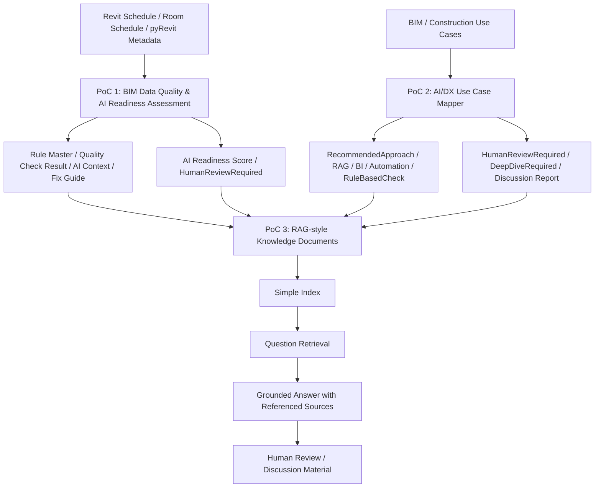
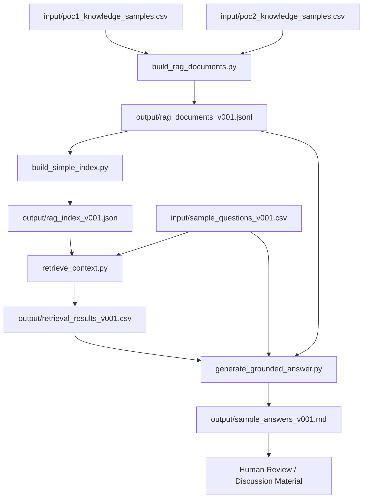

# BIM Data to AI Workflow Blueprint

## 1. このドキュメントの目的

このドキュメントは、PoC 3：BIM / Construction AI Knowledge Assistant において、BIMデータ、AI Readiness評価、建設業務ユースケース分類、RAG-styleナレッジ検索がどのようにつながるかを整理するための設計資料である。

PoC 3では、PoC 1とPoC 2で作成した成果物を検索対象にし、BIM担当者やAI/DX導入担当者が、根拠付きで確認できるローカルRAG-styleナレッジアシスタントを作成する。

このドキュメントでは、以下の流れを整理する。

```text
BIM Data
↓
Data Quality Check
↓
AI Readiness
↓
AI Use Case Mapping
↓
RAG-style Knowledge Documents
↓
Grounded Answer
↓
Human Review / Discussion Material
```

このPoCの目的は、AIが最終判断を行うことではない。

PoC 1・PoC 2で整理した情報を、質問に応じて検索・抽出し、関係者が確認・協議するための回答案と参照情報を提示することを目的とする。

---

## 2. PoC 1・PoC 2・PoC 3 の関係

PoC 1・PoC 2・PoC 3 の関係は以下である。

```text
PoC 1：
BIMデータがAI活用に適しているかを評価する

PoC 2：
BIM・建設業務がどのAI/DX活用に適しているかを分類する

PoC 3：
PoC 1・PoC 2の成果物を検索し、根拠付きで説明する
```

PoC 1では、Revit/BIMデータをAIやデータ活用に使う前提として、データ品質、AI Readiness、Human Review要否を評価した。

PoC 2では、BIM・建設業務ユースケースを、RAG、BI、自動化、ルールベースチェック、人間レビュー、深掘り対象などのAI/DX活用パターンに分類した。

PoC 3では、PoC 1とPoC 2の成果物を検索可能なナレッジとして整理し、質問に対して関連情報を検索し、根拠付きの回答案を生成する。

---

## 3. 全体ワークフロー

PoC 3で想定する全体ワークフローは以下である。

```text
Revit Schedule / Room Schedule / pyRevit Metadata
↓
PoC 1：BIM Data Quality & AI Readiness Assessment
↓
Rule Master / Quality Check Result / AI Context / Fix Guide / AI Readiness Score
↓
PoC 2：BIM / Construction AI Use Case Mapper
↓
AI Use Case Mapping / RecommendedApproach / HumanReviewRequired / DeepDiveRequired
↓
PoC 3：BIM / Construction AI Knowledge Assistant
↓
RAG-style Knowledge Documents
↓
Simple Index
↓
Question Retrieval
↓
Grounded Answer
↓
Human Review / Discussion Material
```

この流れにより、BIMデータ品質、建設業務ユースケース分類、生成AI/RAG-styleナレッジ検索、Human Review設計を一連の流れとして示す。

---

## 4. PoC 1：BIM Data Quality & AI Readiness Assessment

### 4.1 PoC 1 の役割

PoC 1は、BIMデータがAI活用に適しているかを評価するためのPoCである。

主な役割は以下である。

* Revit集計表TXTをCSV化する
* BIMデータをクレンジングする
* RuleIdベースで品質チェックを行う
* QualityScoreを算出する
* AI Readiness Scoreを算出する
* AI Contextを生成する
* Fix Guide Markdownを生成する
* HumanReviewRequiredを設計する
* pyRevitでElementId / UniqueIdなどのメタデータを取得する
* RAG / Azure AI Search構成を検討する

PoC 1の成果物は、PoC 3では「BIMデータ品質・AI Readinessに関する検索対象ナレッジ」として扱う。

---

### 4.2 PoC 1 由来の情報

PoC 3で扱うPoC 1由来の情報は以下である。

```text
Rule Master
Quality Check Result
QualityScore
AI Readiness Score
AI Context
Fix Guide
HumanReviewRequired
pyRevit Metadata
RAG設計方針
```

これらは、BIMデータをAI活用する前に確認すべき品質・不足・修正方針・人間確認要否を説明するためのナレッジになる。

---

### 4.3 PoC 1 由来の質問例

PoC 3では、PoC 1由来の情報に対して、以下のような質問に答えられることを目指す。

```text
このRuleIdの違反は何を意味しますか？
Doorカテゴリの品質チェック結果を教えてください。
RoomカテゴリでAI Readinessが低くなる原因は何ですか？
Fix Guideは何を示していますか？
この指摘はRevitモデルを自動修正してよいですか？
HumanReviewRequired=True の場合、何に注意すべきですか？
```

回答では、RuleId、Category、Severity、Fix Guide、HumanReviewRequired、SourceFileなどを参照情報として示す。

---

## 5. PoC 2：BIM / Construction AI Use Case Mapper

### 5.1 PoC 2 の役割

PoC 2は、BIM・建設業務ユースケースが、どのAI/DX活用に適しているかを分類するためのPoCである。

主な役割は以下である。

* BIM・建設業務ユースケースCSVを作成する
* RAG候補を分類する
* BI候補を分類する
* 自動化候補を分類する
* ルールベースチェック候補を分類する
* HumanReviewRequiredを付与する
* DeepDiveRequiredを付与する
* RecommendedApproachを整理する
* DXサービス候補を生成する
* 協議用レポートを生成する

PoC 2の成果物は、PoC 3では「BIM・建設業務のAI/DX活用方針に関する検索対象ナレッジ」として扱う。

---

### 5.2 PoC 2 由来の情報

PoC 3で扱うPoC 2由来の情報は以下である。

```text
AI Use Case Mapping
RecommendedApproach
RAG候補
BI候補
自動化候補
RuleBasedCheck候補
HumanReviewRequired
DeepDiveRequired
DX Service Candidates
Discussion Reference Report
Classification Rules
Human Review Policy
```

これらは、建設業務をAI/DXにどうつなげるか、どこまで自動化できるか、どこで人間確認が必要かを説明するためのナレッジになる。

---

### 5.3 PoC 2 由来の質問例

PoC 3では、PoC 2由来の情報に対して、以下のような質問に答えられることを目指す。

```text
このユースケースはRAGに向いていますか？
この業務はAIで自動化してよいですか？
HumanReviewRequired=True になる理由は何ですか？
DeepDiveRequired の業務では何を追加確認すべきですか？
PoC 2のRecommendedApproachは何を意味しますか？
PoC 1とPoC 2はどうつながりますか？
```

回答では、UseCaseId、RecommendedApproach、RAGSuitable、BISuitable、AutomationSuitable、HumanReviewRequired、DeepDiveRequired、SourceFileなどを参照情報として示す。

---

## 6. PoC 3：BIM / Construction AI Knowledge Assistant

### 6.1 PoC 3 の役割

PoC 3は、PoC 1・PoC 2の成果物を検索し、根拠付きで説明するローカルRAG-styleナレッジアシスタントである。

PoC 3では、本格的なクラウドRAGやベクトルDBは使わない。

MVPでは、Python / pandas / JSONL / Markdown / pytest を使い、ローカル環境で再現可能な簡易RAG-style構成を作成する。

---

### 6.2 PoC 3 で行うこと

PoC 3では、以下を行う。

* PoC 1由来のサンプルナレッジを作成する
* PoC 2由来のサンプルナレッジを作成する
* サンプル質問CSVを作成する
* サンプルナレッジをRAG-style document JSONLに変換する
* 各documentにmetadataを付与する
* 簡易検索インデックスを作成する
* 質問に対して関連documentを検索する
* 検索結果をもとに根拠付き回答サンプルをMarkdownで生成する
* 回答に参照元とHuman Review注意書きを含める
* pytestで出力と回答方針を検証する

---

### 6.3 PoC 3 で行わないこと

PoC 3のMVPでは、以下は行わない。

* Azure AI Search の本実装
* Azure OpenAI API 連携
* OpenAI API 連携
* LangChain / LlamaIndex の本格実装
* ベクトルDB本格実装
* FAISS / Chroma の本格利用
* Embedding生成
* Revitモデルの自動修正
* Revit API / pyRevit v2 の新規開発
* COBie Checker の実装
* FixPriority分類モデルの実装
* Construction AI PoC Planning Toolkit 完全版
* 実案件データの利用
* 顧客データの利用
* 社内サービス詳細の利用

PoC 3では、本格的なRAGシステムを作ることではなく、RAG-style Knowledge Assistantの基本構造をポートフォリオとして説明できる形にすることを優先する。

---

## 7. RAG-style Knowledge Documents の位置づけ

PoC 3では、PoC 1・PoC 2の情報をRAG-style Knowledge Documentsとして整理する。

RAG-style Knowledge Documentsは、検索対象となるナレッジの最小単位である。

各documentは、以下のような構造を持つ。

```text
document_id
source_poc
source_type
title
content
metadata
keywords
```

例えば、PoC 1由来のRule Masterであれば、1つのRuleIdを1つのdocumentとして扱う。

PoC 2由来のUse Case Mappingであれば、1つのUseCaseIdを1つのdocumentとして扱う。

---

## 8. Chunk設計との関係

PoC 3では、検索しやすさと説明しやすさを両立するため、ナレッジを適切な単位に分ける。

想定するchunk単位は以下である。

```text
Rule単位
Fix Guide単位
UseCase単位
Policy単位
Summary単位
```

### 8.1 Rule単位

RuleIdごとに、チェック内容、対象カテゴリ、重要度、AI Readinessへの影響、Fix Guide、HumanReviewRequiredをまとめる。

主にPoC 1由来の情報で使用する。

### 8.2 Fix Guide単位

修正方針や確認ポイントごとに、どの品質問題に対応するかをまとめる。

主にPoC 1由来の情報で使用する。

### 8.3 UseCase単位

UseCaseIdごとに、業務名、推奨アプローチ、RAG適性、BI適性、自動化適性、HumanReviewRequired、DeepDiveRequiredをまとめる。

主にPoC 2由来の情報で使用する。

### 8.4 Policy単位

Answer Policy、Human Review Policy、Limitationsなど、PoC全体の方針をまとめる。

PoC 3の回答が断定しすぎないようにするための基準として使用する。

### 8.5 Summary単位

PoC 1・PoC 2・PoC 3の関係や、全体ワークフローを説明するための要約情報として使用する。

---

## 9. Metadata設計との関係

PoC 3では、検索結果の根拠を示すために、各documentへmetadataを付与する。

metadataは、回答時に「どの情報を参照したか」を明示するために使用する。

想定するmetadataは以下である。

```text
DocumentId
SourcePoC
SourceType
Title
Category
RuleId
UseCaseId
Severity
RecommendedApproach
HumanReviewRequired
DeepDiveRequired
Keywords
SourceFile
```

metadataにより、回答時に以下を示せるようにする。

```text
どのPoC由来の情報か
どのファイル由来の情報か
どのRuleIdまたはUseCaseIdに基づく情報か
Human Reviewが必要か
Deep Diveが必要か
どの推奨アプローチに分類されたか
```

---

## 10. Answer Policyとの関係

PoC 3の回答は、検索結果に基づく根拠付き回答として生成する。

回答では、以下を含める。

```text
Question
Answer
Reasoning Summary
Referenced Sources
RuleId
UseCaseId
RecommendedApproach
HumanReviewRequired
DeepDiveRequired
Caution
```

回答では、AIが最終判断するような表現は避ける。

回答は、BIM担当者、設計者、施工担当者、AI/DX導入担当者が確認・協議するための参考情報として扱う。

---

## 11. Human Reviewとの関係

PoC 3では、Human Review方針を重要な前提として扱う。

特に、以下に関わる判断はAIが最終判断しない。

```text
設計判断
施工判断
法規判断
安全判断
契約判断
コスト判断
顧客合意が必要な判断
```

回答には、必要に応じて以下の趣旨を含める。

```text
この回答は協議用の参考情報です。
設計判断、施工判断、法規判断、安全判断、契約判断は人間レビューが必要です。
AIは最終判断を行いません。
```

HumanReviewRequired=True の情報が検索された場合は、回答内で人間確認が必要であることを明示する。

---

## 12. PoC 3 の処理フロー

PoC 3のMVPにおける処理フローは以下である。

```text
input/poc1_knowledge_samples.csv
input/poc2_knowledge_samples.csv
input/sample_questions_v001.csv
↓
src/build_rag_documents.py
↓
output/rag_documents_v001.jsonl
↓
src/build_simple_index.py
↓
output/rag_index_v001.json
↓
src/retrieve_context.py
↓
output/retrieval_results_v001.csv
↓
src/generate_grounded_answer.py
↓
output/sample_answers_v001.md
```

この流れにより、サンプルナレッジ作成、JSONL化、簡易インデックス作成、検索、根拠付き回答生成までをローカルで再現できる。

---

## 13. Mermaidによる全体図



---

## 14. MermaidによるMVP処理フロー



---

## 15. PoC 3で示したい価値

PoC 3で示したい価値は、単に検索機能を作ることではない。

PoC 1・PoC 2で作成した情報を、AI/DX導入前の確認・協議に使えるナレッジとして再利用することである。

具体的には、以下を示す。

```text
BIMデータ品質を確認できる
AI Readinessを説明できる
品質問題とFix Guideをつなげられる
BIM・建設業務のAI/DX適性を説明できる
RAG向き、BI向き、自動化向き、人間レビュー必須の違いを説明できる
回答に参照元を含められる
AIが最終判断しない設計を明示できる
```

これにより、PoC 3は以下のようなポートフォリオ成果物として位置づけられる。

```text
BIMデータ品質
+
建設業務ユースケース分類
+
RAG-styleナレッジ検索
+
根拠付き回答生成
+
Human Review設計
```

---

## 16. このドキュメントの位置づけ

このドキュメントは、PoC 3全体の設計方針を説明する中心資料である。

以降のdocsは、このBlueprintをもとに詳細化する。

```text
docs/chunk_design.md
docs/metadata_design.md
docs/answer_policy.md
docs/human_review_policy.md
docs/limitations.md
```

各ドキュメントの役割は以下である。

```text
chunk_design.md：
ナレッジをどの単位で分割するかを定義する

metadata_design.md：
各documentに付与するmetadataを定義する

answer_policy.md：
回答形式、参照元の示し方、注意書きの入れ方を定義する

human_review_policy.md：
AIが最終判断しない方針、人間確認が必要な判断を定義する

limitations.md：
MVPの制約、対象外、誇張しない表現を定義する
```

---

## 17. まとめ

PoC 3：BIM / Construction AI Knowledge Assistant は、PoC 1・PoC 2の成果物を検索対象にし、根拠付きで説明するローカルRAG-styleナレッジアシスタントMVPである。

PoC 1では、BIMデータ品質とAI Readinessを評価した。

PoC 2では、BIM・建設業務ユースケースをAI/DX活用パターンに分類した。

PoC 3では、それらの成果物をナレッジ化し、質問に応じて関連情報を検索し、参照元付きの回答案を生成する。

最終的な位置づけは以下である。

```text
PoC 1：
BIMデータがAI活用に適しているかを評価する

PoC 2：
BIM・建設業務がどのAI/DX活用に適しているかを分類する

PoC 3：
PoC 1・PoC 2の成果物を検索し、根拠付きで説明する
```

PoC 3は、本格RAGやクラウド連携を目的とするものではない。

Python / pandas / JSONL / Markdown / pytest により、ローカルで再現可能なRAG-style Knowledge Assistantの基本構造を示す個人開発ポートフォリオとして扱う。
